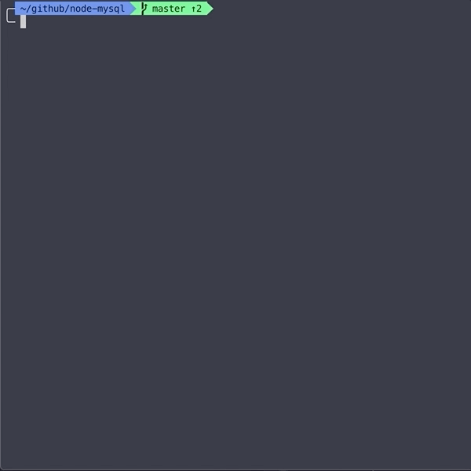

# Bamazon - Node.js and MySQL

## Overview
This assignment used Node.js and MySQl to create an Amazon-like storefront through a command-line interface (CLI) application, called Bamazon. Using Node.js, different user-specific js files can be called, to purchase an item as a customer, or regulate inventory as a manager. 

## Node Packages
This app uses several Node.js packages:
* `inquirer` - for making CLI prompts to the user
* `mysql` - to interect with the Bamazon DB
* `dotenv` - to store MySQL credentials

## Set-up for the App
In order to use the app, you must have Node.js installed.

First, clone the repo, and then run the following to install all of the dependencies:
```javascript
npm install
```

You will also need to set up your own `.env` file with the MySQL root password.
The schema file provided can be used to create the DB, as well as seed data.

## Using the App
### Customer
To use the app as a customer, you must use node to call on the `bamazonCustomer.js` file. The user will be prompted to select from the available products, and then enter the amount to be purchased. If there's enough in stock, the user sees a message indicating the successful purchase; otherwise, a message displays that there was not enough in stock.

* `Purchase from Available Products` - will prompt user to select a product, and then enter the amount of stock being purchased


### Manager
To use the app as a manager, you must use node to call on the `bamazonManager.js` file. The user will be prompted to select from the available options:

* `View Products for Sale` - will list all the products in the DB (name, department, stock-quantity, price)



* `View Low Inventory` - will list all the products in the DB with 5 items or less in stock (name, department, stock-quantity, price)


* `Add to Inventory` - will prompt user to select a product, and then enter the amount of stock being added


* `Add New Product` - will prompt user to enter new product info: name, department, stock quantity, and price


### Supervisor
To use the app as a supervisor, you must use node to call on the `bamazonSupervisor.js` file. The user will be prompted to select from the available options:

* `View Product Sales by Department` - will list all the departments, with their overhead, total sales, and profits (the most consuming part of the HW)


* `Create New Department` - will prompt user to enter new department info: name and overhead

